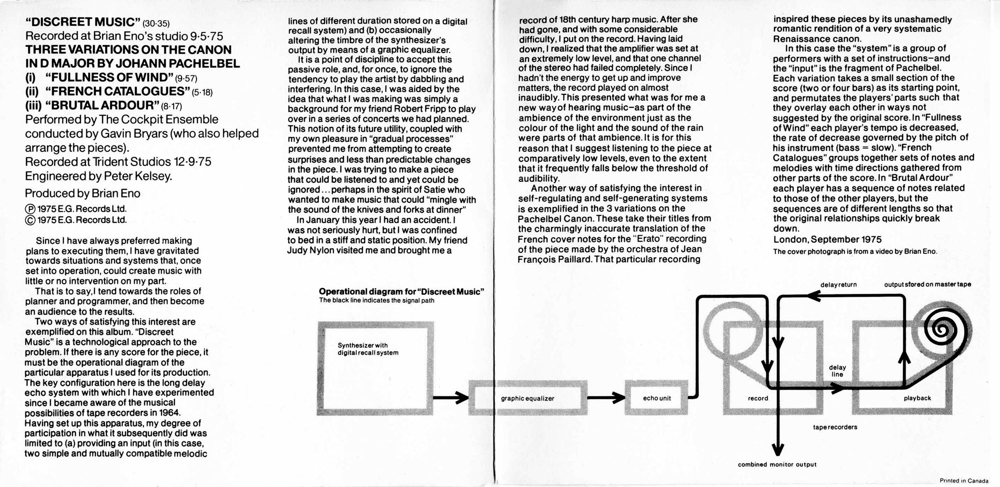

<iframe src="https://shaderpark.com/embed/-OZ3EHXk8r1JyhqgVTCy" width="500" height="500" frameborder="0" style="display: block; margin: 0 auto; border: none;">

</iframe>

::: column-margin
[Department of Visual & Media Arts](https://emerson.edu/academics/academic-departments/visual-media-arts)\
[Emerson College](https://emerson.edu/)\
VM402-08\
Fall Semester 2025\
Thur 4 Sept - Tues 16 Dec\
16:00-17:45  Ansin 502\
[Dr. Martin Roberts](http://mroberts.emerson.build/)\
Office: TBA\
Hours: Tues/Thur 14:30-3:30\
[Canvas](https://canvas.emerson.edu/courses/2136023)\
[](mailto:martin_roberts@emerson.edu) \| [](https://merveilles.town/@dokoissho) \| [](https://github.com/mroberts1/) \| [](https://twitter.com/mroberts_vma)\
:::

 

<small>Shader: [T1 by h2ee](https://shaderpark.com/sculpture/-OZ3EHXk8r1JyhqgVTCy?hideeditor=true&hidepedestal=true) \[[Fullscreen](https://shaderpark.com/embed/-OZ3EHXk8r1JyhqgVTCy)\]</small>

## Description

> <small>It’s very useful in the arts to have certain sorts of systems, \[particularly\] if you’re working with something that doesn’t have immediate limitations because you don’t have enough money. ... Sometimes not having enough money is good, because you don’t end up throwing a million dollars at a five-cent idea. But \[what\] if the idea doesn’t require any money? How do you actually stop yourself from putting too much into an idea that’s too small? You find an external system. And some of the best systems in the world come out of physics, the sciences. Math.</small>
>
> <small>---Judy Nylon, cited in Geeta Dayal, *Another Green Word* (23-24).</small>

Although the term “generative” is today often treated as synonymous with AI-based artistic practices, generative art and aesthetics long predates the digital era, with antecedents that include the experiments with musical chance of John Cage and Lamonte Young, the early computational art of the 1960s, fractal images and music in the 1970s, or the ambient music of Brian Eno. The popularization of algorithmic tools that enable images, music, literary works, animation, and motion graphics to be generated from text and image prompts, however, has led to a surge in interest in code-based and algorithmic forms of creativity, along with debates about the aesthetic and ethical legitimacy of AI-generated artworks and other creative content. While computational art has been able to pass as human since the 1960s, the current explosive growth of algorithmic tools has rekindled aesthetic debates about the technological dimension of art and the relationship of art to the human more generally.

This course explores the history of generative approaches in the media arts, as well as changing social attitudes towards these and the contemporary debate swirling around “AI art.” In addition to historical examples and philosophical dimensions, students are introduced to a variety of generative approaches to artistic creativity, and collaborate on producing generative artworks in a medium of their choice using a variety of tools, frameworks, and platforms.

## Texts

-   [Geeta Dayal](https://www.theoriginalsoundtrack.com/), *Another Green World* (New York: Continuum, 2009).
-   Benedikt Gross, Hartmut Bohnacker, and Julia Laub, [*Generative Design: Visualize, Program, and Create with P5.js*](http://www.generative-gestaltung.de/2/). Princeton, NJ: Princeton Architectural Press, 2018.
-   Philip, Terry, ed., *The Penguin Book of Oulipo*. London: Penguin Classics, 2020.

## Films

-   *John Cage: Journeys in Sound* (Allan Miller and Paul Smaczny, 2012).\
-   [*Eno*](https://www.hustwit.com/eno) (Gary Hustwit, 2024).
-   [*Sisters With Transistors*](https://sisterswithtransistors.com/) (Lisa Rovner, 2022)

## Women in Electronic Music

-   [Ekho: Women in Sonic Art](https://ekhofemalesound.wordpress.com/) \[[Twitter](https://x.com/ekho_femsound)\]
-   [Sarah Davachi](https://sarahdavachi.bandcamp.com/)
-   [Kali Malone](https://kalimalone.bandcamp.com/)
-   [Kara-Lis Coverdale](https://kara-liscoverdale.bandcamp.com/)
-   [Kaitlyn Aurelia Smith](https://kaitlynaureliasmith.bandcamp.com/)
-   [machìna](https://yeoheemusic.bandcamp.com/)
-   [Heejin Jang](https://heejinjang.bandcamp.com/)

## Assignments & Evaluation

Reflection post (weekly, due Friday of each week, 10 required) (40%)\
Audiovisual or Textual Generative Work (20%, due at Thanksgiving)\
Research Paper (20%, due Thur 11 Dec)\
Oblique Strategies Project (20%, due 16 Oct)

## Class Schedule

*Week 1*

**Introduction: Unpromising Beginnings**

Thur_04-Sept

------------------------------------------------------------------------

*Week 2*

**Oblique Strategies**

::: column-margin

:::

Tues_9-Sept

::: column-margin

:::

"Work at a different speed"

-   [Geeta Dayal](https://www.theoriginalsoundtrack.com/), [*Another Green World*, chs. 1-3](pdf/another-green-world-chs1-3.pdf)

Thur_11-Sept

-   Brian Eno, "[Generating and Organizing Variety in the Arts](pdf/eno-generating-organizing-arts.pdf)" (*Studio International*, 1976)
-   Brian Eno, *Music for Airports* (and other albums), [liner notes](pdf/eno-ambient.pdf)
-   Geeta Dayal, *Another Green World*, chs. 4-6

------------------------------------------------------------------------

*Week 3*

Tues_16-Sept

"Interesting failure after interesting failure"

::: column-margin
{.lightbox width="300"}
:::

-   [Geeta Dayal](https://www.theoriginalsoundtrack.com/), *Another Green World*, chs. 7-9

Thur_18-Sept

-   [Geeta Dayal](https://www.theoriginalsoundtrack.com/), *Another Green World*, chs. 10-12
-   "[How Brian Eno Created 'Discreet Music'](https://reverbmachine.com/blog/deconstructing-brian-enos-discreet-music/)"

------------------------------------------------------------------------

*Week 4*

**Imaginary Landscapes: John Cage**

::: column-margin

:::

Tues_23-Sept

-   Screening: *John Cage: Journeys in Sound*

Thur_25-Sept

**Phasing: Steve Reich**

::: column-margin

:::

-   Steve Reich, "[Music as a Gradual Process](http://www.bussigel.com/systemsforplay/wp-content/uploads/2014/02/Reich_Gradual-Process.pdf)" (1968)
-   Terry Riley, *In C*

------------------------------------------------------------------------

*Week 5*

**Waveforms: Women and Generative Music**

::: column-margin







:::

Tues_30-Sept

-   [*Sisters With Transistors*](https://sisterswithtransistors.com/) (Lisa Rovner, 2022) (excerpts)

Thur_02-Oct

**Zones of Precarity**

-   Mandel Cabrera, "[Precarious Sound, Precarious Being: Éliane Radigue's Feedback Works](https://mandelcabrera.com/2019/06/17/precarious-sound-precarious-being-eliane-radigues-feedback-works/)" (*Empassive* (blog), 17 June 2019)
-   Mandel Cabrera, "[Feedback](pdf/mandel-cabrera-feedback.pdf)," in Sharon Jane Mee and Luke Robinson, *Sound Affects: A User's Guide* (New York: Bloomsbury Academic, 2023)
-   "[A Portrait of Éliane Radigue](https://vimeo.com/8983993)" (Institute for Media Archaeology, 2009)

See also:

-   Eliane Radigue, "[The Mysterious Power of the Infinitessimal](pdf/radigue-mysterious-power-infinitesimal.pdf)" (*Leonardo Music Journal* 19 (2009): 47-9)
-   [Ekho: Women in Sonic Art](https://ekhofemalesound.wordpress.com/) \[[Twitter](https://x.com/ekho_femsound)\]

------------------------------------------------------------------------

*Week 6*

**Towards Infinity**

::: {.column-margin}



:::

Tues_07-Oct

-   Raymond Queneau, [*A Hundred Thousand Billion Poems*](https://en.wikipedia.org/wiki/A_Hundred_Thousand_Billion_Poems)
-   [Interactive edition](https://www.bevrowe.info/Internet/Queneau/Queneau.html)
-   Eno, [*77 Million Paintings*](https://en.wikipedia.org/wiki/77_Million_Paintings)
<!-- - [Long Now event](https://legacy.longnow.org/events/02007/jun/29/77-million-paintings-brian-eno/) -->
- [*7 Hours in 77 Million Paintings*](https://vimeo.com/groups/chillounge/videos/638631)(420 mins. \> 35 mins. timelapse)
- [*7 More Hours in 77 Million Paintings*](https://vimeo.com/751767)(420 mins. \> 35 mins. timelapse)
- [Max Cooper](https://www.maxcooper.net/) and Rob Clouth, [*8 Billion Realities*](https://maxcooper.bandcamp.com/album/8-billion-realities) (album, forthcoming,  2025)
- [Max Cooper](https://www.maxcooper.net/), [*One Hundred Billion Sparks*](https://ohbs.maxcooper.net/) (audiovisual album, 2019)

Thur_09-Oct

A Conversation with [Geeta Dayal](https://www.theoriginalsoundtrack.com/)

------------------------------------------------------------------------

*Week 7*

**Language Games**

Tues_14-Oct

- Philip Terry, "[Introduction](pdf/penguin-oulipo-intro.pdf)" (*The Penguin Book of OULIPO*)
- Selected texts by Italo Calvino, Jorge Luis Borges, and Anne Garréta, in [*The Penguin Book of OULIPO*](pdf/calvino-borges-garreta.pdf)"

Thur_16-Oct

-   Rob Clouth, [*The Harry Potter Book Generator*](https://robclouth.com/#projects/the-harry-potter-book-generator)
-   [The People's Republic of Interactive Fiction](https://pr-if.org/about/)
-   [Nick Montfort](https://nickm.com/)
-   [Angela Chang](https://www.anjchang.com/)
-   [Taper](https://www.anjchang.com/taper-digital-zine/) (biannual computational poetry journal)
-   [Bad Quarto](https://badquar.to/) (computational literature publisher)
-   [NanoGenMo](https://nanogenmo.github.io/)

**DEADLINE: Oblique Strategies Project**

------------------------------------------------------------------------

*Week 8*

**Fractal Worlds**

Tues_21-Oct

-   [Mandelbulb](https://www.mandelbulb.com/)\
-   [Fractal Worlds](https://www.youtube.com/watch?v=xj_4jvSDVME&list=PL1ywvug1r6ThGOrb9vQNfqYsI5XNyV3B3&index=14&ab_channel=bib993) (YouTube channel)

Thur_23-Oct

Oblique Strategies Projects

------------------------------------------------------------------------

*Week 9*

**Mondrian: Computer Graphics**

::: column-margin

:::

Tues_28-Oct

-   Amy Goodchild, "[Early Computer Art in the '50s and '60s](https://www.amygoodchild.com/blog/computer-art-50s-and-60s)"
-   A. Michael Noll, "Human or Machine? A Subjective Comparison of Piet Mondrian's 'Composition With Lines' (1917) and a Computer-Generated Picture"
-   [Early 3D Computer Graphics from Bell Labs](https://youtu.be/M4nql28E_AE)

Thur_30-Oct

-   Lev Manovich, "Who is 'An Artist' in the 'AI Era'?"
-   Processing Mondrian

------------------------------------------------------------------------

*Week 10*

**Ecosystems**

Tues_04-Nov

Conway's Game of Life

Thur_06-Nov

Lenia

------------------------------------------------------------------------

*Week 11*

Veterans Day

Thur_13-Nov

**Procedural Worlds**

-   Simon Parkin, "[A Journey to the End of the World (of Minecraft)](https://www.newyorker.com/tech/annals-of-technology/a-journey-to-the-end-of-the-world-of-minecraft)" (*The New Yorker*, 23 January 2014)

-   [Wave Function Collapse](https://marian42.itch.io/wfc)

::: column-margin

:::

------------------------------------------------------------------------

*Week 12*

**Generative Art & Design**

Tues_18-Nov

-   [Generative Design](http://www.generative-gestaltung.de/2/)

Thur_20-Nov

-   Read the interviews with [Josef Pelz](https://www.generativehut.com/post/interview-with-josef-pelz), [Étienne Jacob](https://www.generativehut.com/post/interview-with-etienne-jacob), [Shohei Fujimoto](https://www.generativehut.com/post/interview-with-shohei-fujimoto), [Giulia Cosco](https://www.generativehut.com/post/interview-with-giulia-cosco), and/or [Pierre Paslier](https://www.generativehut.com/post/interview-with-pierre-paslier)

------------------------------------------------------------------------

*Week 13*

Tues_25-Nov

TBA

Thanksgiving

------------------------------------------------------------------------

*Week 14*

Tues_02-Dec Presentations

Thur_04-Dec Presentations

------------------------------------------------------------------------

*Week 15*

Tues_09-Dec Presentations

Thur_11-Dec Presentations

------------------------------------------------------------------------

*Week 16*

Tues_16-Dec Conclusion

------------------------------------------------------------------------

## Policies

**Attendance and Participation**\
Full participation in class discussions and timely submission of all assignments constitutes evidence of class attendance. Students are expected to allocate sufficient time to complete all the requirements for each module: reading, viewing, responding to discussion questions, submitting replies to classmates, and completing other assignments on time. Failure to keep up with the pace of the course may result in lower grades or the failure of the class.

**Academic Honesty**\
Do not plagiarize. Plagiarism is using someone else’s work without giving them fair credit. Plagiarism and cheating will result in an “F” for the assignment.

**Accommodations**\
Emerson is committed to providing equal access and support to all qualified students through the provision of reasonable accommodations, so that each student may fully participate in the Emerson experience. Student Accessibility Services (SAS) staff will be working remotely for the fall of 2020. If you have a disability that may require accommodations, please contact them at [*SAS\@emerson.edu*](mailto:SAS@emerson.edu) or at (617)824-8592 to make an appointment with an SAS staff member.

Students are encouraged to contact SAS early in the semester. Please note that accommodations are not applied retroactively.

**Plagiarism Statement**\
It is the responsibility of all Emerson students to know and adhere to the College’s policy on plagiarism, which can be found at: [*http://www.emerson.edu/policy/plagiarism*](http://www.emerson.edu/policy/plagiarism)\*. If you have any question concerning the Emerson plagiarism policy or about documentation of sources in work you produce in this course, speak to your instructor.

**Diversity Statement**\
Every student in this class will be honored and respected as an individual with distinct experiences, talents, and backgrounds. Students will be treated fairly regardless of race, religion, sexual orientation, gender identification, disability, socio-economic status, or national identity. Issues of diversity may be a part of class discussion, assigned material, and projects. The instructor will make every effort to ensure that an inclusive environment exists for all students. If you have any concerns or suggestions for improving the classroom climate, please do not hesitate to speak with the course instructor or to contact the Office of Diversity and Inclusion at 617-824-8528 or by email at [*diversity*inclusion\@emerson.edu\*](mailto:diversity*inclusion@emerson.edu)
